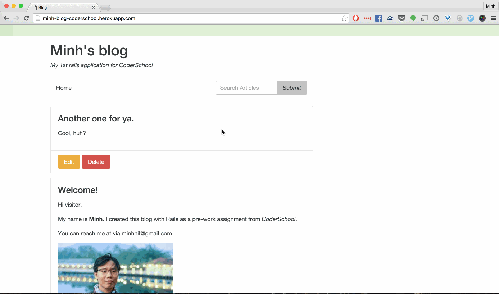

# Pre-work - Minh's Blog

**Minh's Blog** is a Ruby on Rails blog application.

Submitted by: **Minh Nguyen**

Time spent: **8** hours spent in total

URL: **http://minh-blog-coderschool.herokuapp.com/**

## User Stories

The following **required** functionality is complete:

* [X] User can create a new post, formatted using the Markdown language.
* [X] User can edit an existing post.
* [X] There is one post that introduces the App Creator with name, picture.
* [X] User can delete stories, with an alert that asks the user to confirm.
* [X] User see a search form on the Posts page.
* [X] User can submit a search term to find all posts bywith titles containing the search term.

The following **optional** features are implemented:

* [X] There is a "navbar" that is responsive to window size similar to http://v4-alpha.getbootstrap.com/examples/navbar/. 
* [ ] User can see how many views a post has. 
* [ ] User can leave a comment on a post.
* [ ] User can add "tags" to a post, and filter posts by tag. 

The following **additional** features are implemented:

- [ ] Route root to articles/index path.

## Video Walkthrough 

Here's a walkthrough of implemented user stories:

## Notes

Describe any challenges encountered while building the app.

## License

    Copyright 2016 Minh Nguyen

    Licensed under the Apache License, Version 2.0 (the "License");
    you may not use this file except in compliance with the License.
    You may obtain a copy of the License at

        http://www.apache.org/licenses/LICENSE-2.0

    Unless required by applicable law or agreed to in writing, software
    distributed under the License is distributed on an "AS IS" BASIS,
    WITHOUT WARRANTIES OR CONDITIONS OF ANY KIND, either express or implied.
    See the License for the specific language governing permissions and
    limitations under the License.